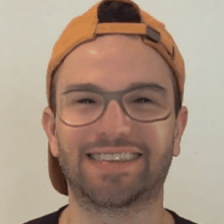
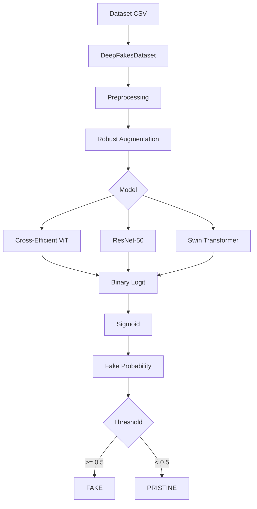
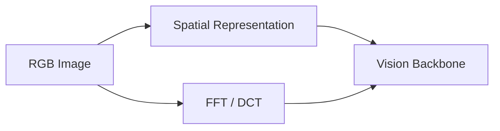
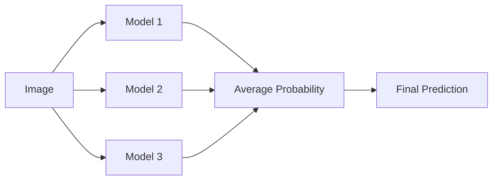

# 🧠 Deepfake Image & Video Analyzer

> Research-oriented deepfake detection using robust augmentation, frequency-domain analysis, CNNs, and Vision Transformers.

<p align="center">
  <a href="./Research-paper-deepfake-model-by-sm.pdf">
    
  </a>
  
  
  
  
  
</p>

<p align="center">
  
</p>

---

## 📄 Research Paper

> ### DFAD 2023 — Challenge on DeepFake Analysis and Detection
>
> **🏆 1st Place — DFAD 2023**  
> **Authors:** Davide Alessandro Coccomini, Giuseppe Amato, Fabrizio Falchi, Claudio Gennaro  
> **Institution:** ISTI-CNR
>
> This repository follows the research direction and implementation strategy introduced in the DFAD 2023 challenge. The original work provides the foundation for the augmentation, validation strategy, and model exploration used here.
>
> **[📥 Read the Research Paper](./Research-paper-deepfake-model-by-sm.pdf)**

This repository is a research implementation and experimentation project based on the DFAD 2023 methodology. It does not claim to independently reproduce every reported benchmark result from the original challenge unless the evidence exists in this repo.

---

## What this project does

This project implements a research-oriented binary deepfake detector for image classification. It combines:

- strong image augmentation
- frequency-domain transforms such as FFT and DCT
- multiple vision backbones
- validation-set construction for synthetic image generalization
- training, evaluation, and ensemble inference workflows

The goal is to classify an image as either:

- `PRISTINE` / real
- `FAKE` / synthetic

---

## Key capabilities

| Capability | Status |
|---|---:|
| Deepfake image classification | ✅ |
| Cross-Efficient ViT | ✅ |
| ResNet-50 | ✅ |
| Swin Transformer | ✅ |
| Strong augmentation pipeline | ✅ |
| FFT / DCT transforms | ✅ |
| Ensemble prediction | ✅ |
| Error analysis | ✅ |
| CLIP feature + t-SNE analysis | ✅ |
| Colab workflow | ✅ |
| End-to-end video inference pipeline | ⚠️ Not currently implemented as full repo workflow |

---

## System overview



The verified root workflow is image-level classification: an input image is preprocessed, augmented, passed through a trained model, and scored as real or fake.

---

## Model families in this repo

| Model | Role | Notes |
|---|---|---|
| Cross-Efficient ViT | Multi-scale transformer + CNN hybrid | Implemented in `cross_efficient_vit.py` and `cross-efficient-vit/` |
| ResNet-50 | CNN baseline | Common pretrained backbone |
| Swin Transformer | Hierarchical vision transformer | Supported through `timm` |

CLI selection:

- `--model 0` → Cross-Efficient ViT
- `--model 1` → ResNet-50
- `--model 2` → Swin Transformer

---

## Data augmentation

The augmentation pipeline is a major part of the project and is defined in `deepfakes_dataset.py`.

### Included augmentations

| Category | Examples |
|---|---|
| Quality degradation | JPEG/Image compression |
| Noise | Gaussian, ISO, multiplicative |
| Geometry | resize, crop, flip, rotation |
| Appearance | brightness, contrast, gamma, sepia |
| Occlusion | cutout, coarse dropout |
| Blur | Gaussian blur, median blur, motion blur |
| Frequency-domain | FFT, DCT |

### Augmentation visual


This is designed to prevent the detector from learning one narrow artifact and instead improve generalization to unseen synthetic images.

---

## Frequency-domain processing

The repo explicitly includes frequency-domain experimentation with:

- `FFT`
- `DCT`

This is important because deepfake artifacts can be subtle in RGB space but more visible in transformed frequency representations. The dataset supports an image mode that can include DCT-based preprocessing.



---

## Research validation strategy

The repository includes validation-set construction logic tailored to generalization testing.

```text
2,500 pristine images
+
2,500 fake images
=
5,000 validation images
```

The fake-image sources include multiple generative families, including:

- StyleGAN
- StyleGAN2
- ProGAN
- RelGAN
- GLIDE
- Stable Diffusion

This is intended to test generalization across different synthetic-generation methods rather than only a single source family.

---

## Evaluation

The repo includes training and evaluation scripts for model validation and inference.

| Metric | Purpose |
|---|---|
| Accuracy | Overall classification quality |
| F1 Score | Balance precision and recall |
| ROC-AUC | Threshold-independent ranking |
| Error Analysis | Evaluate difficult generation methods |

> No independently reproduced benchmark numbers are claimed in this repository. The original power of the approach comes from the DFAD 2023 research and the implementation strategy reflected here.

---

## Ensemble inference



The evaluation pipeline supports ensemble prediction via `--ensemble`, combining multiple checkpoints before applying the final decision threshold.

---

## Explainability and feature analysis

The repo contains `compare_features.py`, which performs CLIP feature extraction and t-SNE visualization to compare real vs fake embedding distributions.

This is a lightweight visual analysis utility and is not the core production pipeline.

---

## Quick start

### Install dependencies

```bash
pip install timm albumentations progress datasets torchsr PyYAML scikit-learn
```

### Train a model

```bash
python train.py \
  --config configs/architecture.yaml \
  --training_csv /path/to/training_set.csv \
  --validation_csv /path/to/validation_set.csv \
  --models_output_path models/ \
  --model 2 \
  --num_epochs 60 \
  --workers 2
```

### Run inference

```bash
python test.py \
  --config configs/architecture.yaml \
  --test_folder /path/to/test_set/ \
  --model1_weights /path/to/checkpoint \
  --model 2 \
  --workers 2
```

### Help

```bash
python train.py --help
python test.py --help
```

---

## Google Colab

A notebook setup is included for Colab usage:

[▶️ Open `colab_setup.ipynb`](./colab_setup.ipynb)

---

## Repository structure

```text
Deepfake-Image-and-video-analyzer/
├── train.py
├── test.py
├── deepfakes_dataset.py
├── augment.py
├── compare_features.py
├── construct_training_set_csv.py
├── construct_validation_set.py
├── cross_efficient_vit.py
├── resnet101.py
├── configs/
├── cross-efficient-vit/
├── efficient_net/
├── transforms/
├── images/
├── colab_setup.ipynb
├── Research-paper-deepfake-model-by-sm.pdf
├── README.md
└── .gitignore
```

Important files:

- `train.py` — model training pipeline
- `test.py` — inference and evaluation
- `deepfakes_dataset.py` — dataset and augmentations
- `augment.py` — augmentation visualization
- `compare_features.py` — feature-space / t-SNE analysis
- `construct_validation_set.py` — validation-set creation

---

## Video scope and current limitation

> The verified root pipeline in this repository is image-level deepfake classification.

A full end-to-end video processing pipeline with frame extraction, temporal aggregation, and video-level scoring is not currently represented as a complete implemented workflow in the repo.

```text
Video
  ↓
Frame Sampling
  ↓
Frame-level Classification
  ↓
Temporal Aggregation (planned extension)
  ↓
Video Score
```

This project is best understood as a strong frame-level deepfake detection pipeline, which can serve as the foundation for future video extensions.

---

## Limitations

- dataset shift can reduce performance on unseen generators
- compression, quality variation, and resampling can affect predictions
- model confidence is not forensic proof
- current verified repo workflow is image-level, not full video-level analysis
- results should be interpreted as ML classification outputs rather than absolute authenticity claims

---

## Research context and credits

This project is based on the original DFAD 2023 challenge work by:

- Davide Alessandro Coccomini
- Giuseppe Amato
- Fabrizio Falchi
- Claudio Gennaro
- ISTI-CNR

**1st place — DFAD 2023**

The included PDF is a central part of this repository and should be treated as the research reference for the implementation direction used here.

---

## 📎 Project links

- GitHub: https://github.com/ShlokMishra01/Deepfake-Image-and-video-analyzer
- Research paper: [./Research-paper-deepfake-model-by-sm.pdf](./Research-paper-deepfake-model-by-sm.pdf)

---

## Final takeaway

This repository is a research-oriented deepfake detection project that focuses on:

- robust augmentation
- image-level classification
- model experimentation
- frequency-domain analysis
- validation on multiple synthetic-generation families

It is designed as a clean, practical, and research-friendly implementation grounded in the DFAD 2023 methodology, rather than as a fully audited production video-forensics system.
